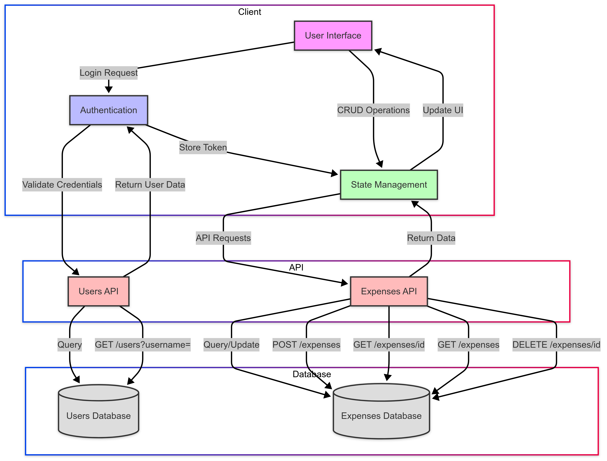

# 💰 Personal Finance Tracker

<div align="center">


[](https://opensource.org/licenses/MIT)
[](http://makeapullrequest.com)

</div>

A cross-platform mobile application built with React Native and Expo that helps users track their daily expenses, set budgets, and visualize their spending habits. 📱

## ✨ Features

### 🔐 Authentication & Security

- Secure user authentication
- Token-based session management
- Protected routes and data

### 💰 Expense Management

- 📝 Create new expenses
- 👁️ View detailed expense information
- 📋 List all expenses with search
- 🗑️ Delete expenses with confirmation
- 📊 Visualize spending patterns

### 🎯 Additional Features

- 📱 Cross-platform support (iOS & Android)
- 🔔 Budget notifications
- 📈 Spending analytics
- 🔍 Advanced search functionality

## 🛠️ Tech Stack

- **Frontend Framework:** React Native
- **Development Platform:** Expo
- **API Integration:** Axios
- **Navigation:** React Navigation
- **Styling:** TailwindCSS
- **Language:** TypeScript
- **State Management:** React Context

## 🔌 API Integration

The app integrates with the following endpoints:

```typescript
const API_ENDPOINTS = {
  users: "https://67ac71475853dfff53dab929.mockapi.io/api/v1/users",
  expenses: "https://67ac71475853dfff53dab929.mockapi.io/api/v1/expenses",
};
```

## 🚀 Getting Started

### Prerequisites

- Node.js (v14 or higher)
- npm or yarn
- Expo CLI
- iOS Simulator (for Mac) or Android Emulator

### Installation

1. **Clone the repository:**

```bash
git clone [https://github.com/Nbruchi/expense-tracker.git]
cd expense-tracker
```

2. **Install dependencies:**

```bash
npm install
# or
yarn install
```

3. **Start the development server:**

```bash
npx expo start
```

4. **Run on your preferred platform:**

- Press `i` for iOS simulator
- Press `a` for Android emulator
- Scan QR code with Expo Go app on your physical device

## 📊 Data Flow Diagram



### Data Flow Description

1. **Authentication Flow**

   - User enters credentials in the UI
   - Authentication module validates credentials against Users API
   - On success, token is stored in state management
   - Protected routes check for valid token

2. **Expense Management Flow**

   - User interacts with UI to perform CRUD operations
   - State management handles API requests
   - Expenses API processes requests and interacts with database
   - Updated data flows back to UI through state management

3. **API Endpoints**
   - Users API: `GET /users?username=` - User authentication
   - Expenses API:
     - `POST /expenses` - Create new expense
     - `GET /expenses/{id}` - Get specific expense
     - `GET /expenses` - List all expenses
     - `DELETE /expenses/{id}` - Delete expense

## 🏗️ System Architecture


### Architecture Components

1. **Frontend Layer**

   - **UI Layer**
     - Tab-based navigation (`(tabs)/`)
     - Expense management screens (`expenses/`)
     - Authentication screens (`auth/`)
   - **Components**
     - Reusable UI components
     - Form components
     - Card components for expenses
   - **State Management**
     - React Context for global state
     - Auth Context for user management
     - Expense Context for expense data
   - **Utilities**
     - Form validation
     - Data formatting
     - Helper functions

2. **Services Layer**

   - API Service for HTTP requests
   - Auth Service for authentication
   - Expense Service for expense management

3. **Backend Layer**
   - Users API for authentication
   - Expenses API for CRUD operations

### Key Features Implementation

1. **Authentication Flow**

   - User login/logout
   - Token management
   - Protected routes

2. **Expense Management**

   - Create, read, update, delete operations
   - Data validation
   - Error handling

3. **UI/UX Features**
   - Responsive design
   - Loading states
   - Error messages
   - Form validation

## 📁 Project Structure

```
expense-tracker/
├── app/
│   ├── (tabs)/           # Tab-based navigation screens
│   ├── expenses/         # Expense-related screens
│   ├── context/          # React Context providers
│   ├── services/         # API services
│   └── utils/            # Utility functions
├── components/           # Reusable components
└── assets/              # Static assets
```

## 🎨 Features Implementation

### Authentication

- ✅ User login with username/password validation
- 🔒 Secure token management
- ⚠️ Error handling for invalid credentials

### Expense Management

- ✅ Create new expenses with validation
- ✅ View detailed expense information
- ✅ List all expenses with search functionality
- ✅ Delete expenses with confirmation
- ⚠️ Error handling for API failures

### UI/UX

- 🎯 Modern and intuitive interface
- 📱 Responsive design for all screen sizes
- ⏳ Loading states and error messages
- ✅ Form validation feedback

## 📝 Development Guidelines

1. **TypeScript Best Practices**

   - Use proper type definitions
   - Follow naming conventions
   - Implement interfaces for data structures

2. **Error Handling**

   - Implement try-catch blocks
   - Show user-friendly error messages
   - Log errors for debugging

3. **Code Quality**
   - Follow component structure
   - Implement proper validation
   - Write clean, maintainable code

## 🧪 Testing

The app can be tested using:

- 🖥️ Expo CLI for development
- 📱 Physical devices using Expo Go app
- 🍎 iOS Simulator
- 🤖 Android Emulator

## 🤝 Contributing

1. Fork the repository
2. Create your feature branch (`git checkout -b feature/AmazingFeature`)
3. Commit your changes (`git commit -m 'Add some AmazingFeature'`)
4. Push to the branch (`git push origin feature/AmazingFeature`)
5. Open a Pull Request

## 📄 License

This project is licensed under the MIT License - see the [LICENSE](LICENSE) file for details.

## 🙏 Acknowledgments

- **ABCD Ltd** for the project requirements
- **MockAPI.io** for providing the backend API
- **Expo team** for the amazing development tools

---

<div align="center">
Made with ❤️ by [Bruce NKUNDABAGENZI]
</div>
